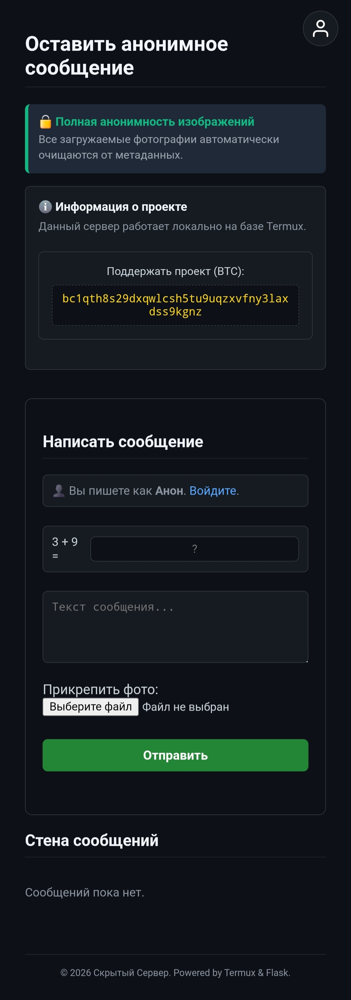

# 🔒 Скрытый Сервер (Termux & Flask)

Анонимная стена сообщений с автоматической очисткой метаданных (EXIF), исправлением ориентации изображений, детекцией ИИ-генераций и встроенной админ-панелью. Проект оптимизирован для запуска на мобильных устройствах через Termux.

---

## 📸 Интерфейс проекта



> *Удобный и лаконичный интерфейс в стиле Darknet с глубокой тёмной темой, информационной плашкой и защитой в виде простой математической капчи.*

---

## 🔥 Основные фичи

- **Абсолютная анонимность картинок:** Полное удаление EXIF-метаданных (геолокация, модель камеры, дата съемки) при загрузке.
- **Детекция ИИ-генераций:** Поиск цифровых подписей (C2PA, Google AI, DALL-E, Midjourney, Adobe Firefly, Stable Diffusion) в загружаемых изображениях.
- **Авто-ориентация:** Исправление перевернутых мобильных фотографий с помощью Pillow.
- **Умная Админка:** 
  - Просмотр активных и удаленных постов по вкладкам.
  - Мягкое удаление (перенос в корзину с перемещением файлов в защищенную папку `deleted`).
  - Редактирование сообщений и быстрые ответы от имени Администратора.
  - Очистка логов и корзины в один клик.
- **Авторизация:** Простая сессионная система регистрации/входа для пользователей и защищенный хэшем пароль админа.

---

## 🛠 Установка и запуск (в Termux или ПК)

### 1. Подготовка окружения (в Termux)
Обновите пакеты и установите необходимые системные библиотеки для работы с Python и Pillow:
```bash
pkg update && pkg upgrade
pkg install git python libjpeg-turbo
```

### 2. Клонирование и установка зависимостей
Склонируйте репозиторий и установите библиотеки из `requirements.txt`:
```bash
git clone https://github.com/Jeekepep/tor-anon-website.git
cd tor-anon-website
pip install -r requirements.txt
```

### 3. Настройка окружения
Создайте файл `.env` в корне проекта на основе шаблона:
```bash
cp .env.example .env
```
Заполните `.env` своими данными:
```ini
SECRET_KEY=супер_секретный_ключ_для_подписи_сессий
ADMIN_PASSWORD_HASH=pbkdf2:sha256:ваш_хэш_пароля
```
Пароль админа по умолчанию  `prostest123`.

### 4. Запуск сервера
```bash
python app.py
```
После запуска проект будет доступен по адресу: `http://localhost:8080` (или `http://IP_АДРЕС_ТЕЛЕФОНА:8080` для локальной сети). Панель администратора находится по адресу `http://localhost:8080/admin`.

---

## 🤝 Поддержка автора

Если вам понравился проект, вы можете поддержать автора:
* **BTC:** `bc1qth8s29dxqwlsh5tu9uqzxvfny31axdss9kgnz`
